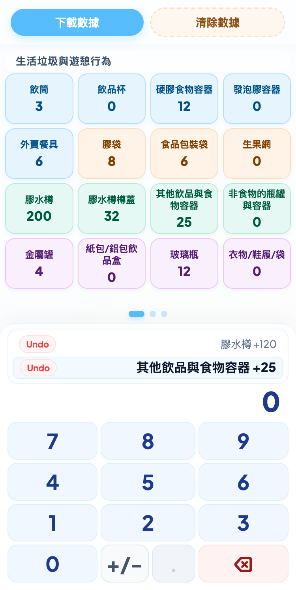
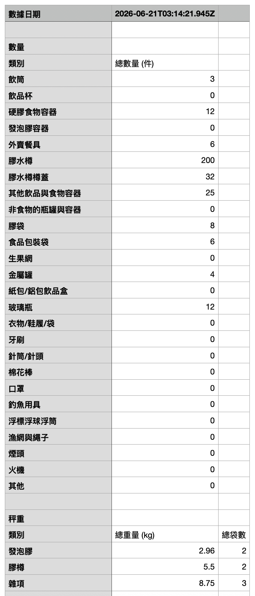

# 數海廢（淨灘統計工具）


這是一個專為淨灘活動設計的輕量化統計工具。它可以幫助志願者在清理海岸時，快速記錄垃圾的種類、數量和重量，並可導出數據進行統計。

## 主要功能

- **快速計數**：預設多種常見海洋垃圾類別（如飲筒、塑膠袋、漁網等）。
- **重量記錄**：支持記錄大體積垃圾（如發泡膠、膠樽）的重量。
- **數據導出**：一鍵導出 CSV 格式的統計數據，方便製作清理報告。
- **離線使用**：數據儲存於瀏覽器本地，確保在岸邊信號不佳時也能穩定操作。

## 介面預覽

| 應用程式介面 | 導出的 CSV 數據 |
| :---: | :---: |
|  |  |

---

## Development Guide

### Quick Start

```bash
npm install
npm run dev
```